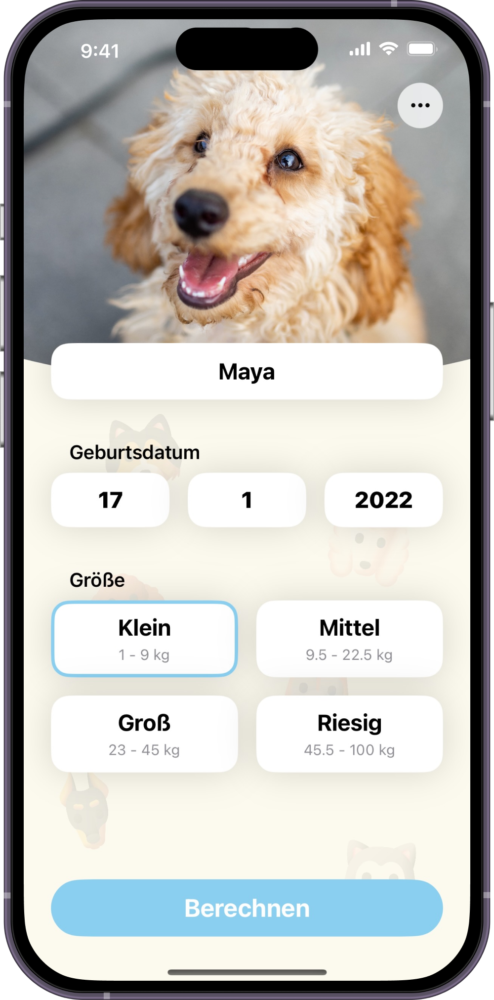

# SoulDating

"Entdecke, verbinde und verliebe dich in deiner Nähe!"

## Über die App

Soul Dating ist eine moderne iOS- Dating-App die darauf abzielt, Singles zusammenzuführen. Dafür verwendet die App Standorte des Users, um Ihnen potenzielle Matches in ihrem Umkreis vorzuschlagen.
Die App ist ideal für Personen, die daran interessiert sind, neue Menschen in der Umgebung kennenzulernen. SoulDating bietet eine einfache und nicht zu sehr von Werbung überladene Benutzeroberfläche.

## Design

  
  
  

## Features
Hier kommen alle Features rein, welche deine App bietet.

- [x] Standortbasierte Nutzer-Vorschläge
- [x] Swiping - Mechanik: Swipe nach rechts für Like und nach links für Pass
- [x] Chat-Funktion: Kommuniziere direkt mit deinen Matches über eingebaute Nachrichtenfunktionen.
- [x] Anpassbare Benutzerpräferenzen: Ändere deine Vorlieben,  oder setze einen neuen Standort um Menschen aus einer anderen Umgebung kennenzulernen.
- [x] Like-Ansicht: Kontrolliere welche Nutzer dich geliked haben oder wen du geliked hast sowie Matches!
- [x] Chat-Bot: Lasse dir Flirtsprüche generieren um das Eis zu brechen! Oder führe komplette Konversationen und lass dir Tipps für Dating geben!

## Technischer Aufbau

#### Projektaufbau
##### Architektur: MVVM für eine Trennung von Logik und UI
##### Ordnerstruktur: 
- Models: Datenmodelle für FireBase usw.
- Views: UI-Komponenten
- ViewModels: Logik und Datenverarbeitung
- Utilities:: Enthält u.a. Manager für Firebase, RangeChecks, zusätzliche Json Dateien, Enums, Modifier und Extensions

#### Datenspeicherung
Firestore-Dokumente: Nutzerdaten, Präferenzen und Match/Chat Informationen werden sicher in Firestore gespeichert. Dies bietet eine leichte skalierbare Lösung für Echtzeit-Daten und Updates für z.bsp. die Chats.

#### API Calls
OpenAI Api, zur generierung von zufälligen Flirtsprüchen als Assistent. Ggf. ein indididuellen Bot für Dating fragen.

#### 3rd-Party Frameworks
Firebase SDK: Für Benutzerauthentifizierung und Datenbankdienste.
Swift Open AI https://github.com/SwiftBeta/SwiftOpenAI für Interaktion mit OpenAI Api
