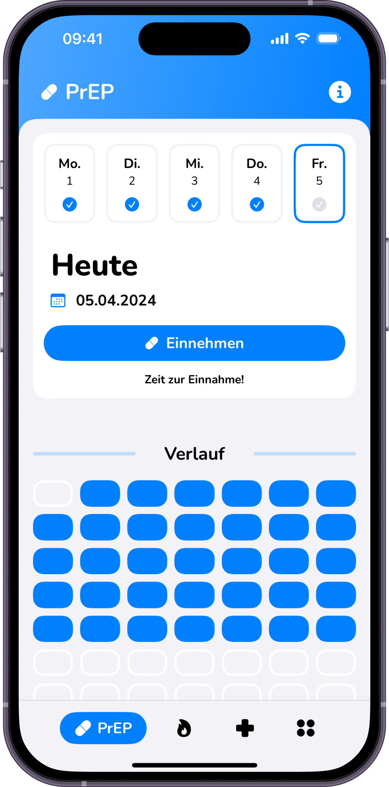

# SoulDating

"Entdecke, verbinde und verliebe dich in deiner Nähe!"

## Über die App

Soul Dating ist eine moderne iOS- Dating-App die darauf abzielt, Singles zusammenzuführen. Dafür verwendet die App Standorte des Users, um Ihnen potenzielle Matches in ihrem Umkreis vorzuschlagen.
Die App ist ideal für Personen, die daran interessiert sind, neue Menschen in der Umgebung kennenzulernen. SoulDating bietet eine einfache und nicht zu sehr von Werbung überladene Benutzeroberfläche.

## Design
Füge hier am Ende die Screenshots deiner App ein (achte hierbei auf die Guidelines).

  
  
  

## Features
Hier kommen alle Features rein, welche deine App bietet.

- [ ] Standortbasierte Match-Vorschläge
- [ ] Swiping - Mechanik: Swipe nach rechts für Like und nach links für Pass
- [ ] Chat-Funktion: Kommuniziere direkt mit deinen Matches über eingebaute Nachrichtenfunktionen.
- [ ] Anpassbare Benutzerpräferenzen: Ändere deine Vorlieben o.ä., setze einen neuen Standort um Menschen aus einer anderen Umgebung kennenzulernen.
- [ ] Like-Ansicht: Siehe wer dich geliked hat in einer Übersicht.
- [ ] Chat-Bot: Lasse dir Flirtsprüche generieren um das Eis zu brechen!

## Technischer Aufbau

#### Projektaufbau
##### Architektur: MVVM für eine Trennung von Logik und UI
##### Ordnerstruktur: 
- Models: Datenmodelle für FireBase usw.
- Views: UI-Komponenten
- ViewModels: Logik und Datenverarbeitung
- Repositories: Anfragen an APIs

#### Datenspeicherung
Firestore-Dokumente: Nutzerdaten, Präferenzen und Match/Chat Informationen werden sicher in Firestore gespeichert. Dies bietet eine leichte skalierbare Lösung für Echtzeit-Daten und Updates für z.bsp. die Chats.

#### API Calls
OpenAI Api, zur generierung von zufälligen Flirtsprüchen als Assistent. Ggf. ein indididuellen Bot für Dating fragen.

#### 3rd-Party Frameworks
Firebase SDK: Für Benutzerauthentifizierung und Datenbankdienste.
OpenAI (https://github.com/MacPaw/OpenAI)

## Ausblick
Beschreibe hier, wo die Reise nach deinem Praxisprojekt hin geht. Was möchtest du in Zukunft noch ergänzen?

- [ ] Apple Maps mit Veranstaltungs Markings die als Date-Locations dienen könnten
- [ ] Bot Generierung von Eisbrechern zugeschnitten auf das jeweilige Userprofil welches angeschrieben werden soll.
